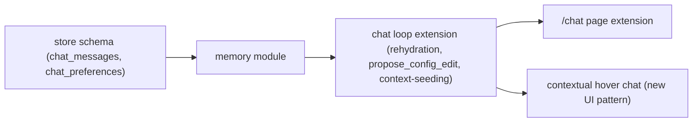

# Horizontal Plan: Chat Co-Pilot + Self-Tuning

Layers touched, and their dependency order.

## Layers

1. **Memory module** (`src/lib/chat/memory.ts`, new) — the narrow read/write
   interface `agent-chat-loop.ts` calls instead of touching SQLite
   directly (design-discussion.md §6.1). Two concerns: conversation
   persistence (messages survive a restart) and a gated preferences record
   (structured notes the config-edit tool's proposals can reference/cite,
   never a silent automatic effect).
2. **Store schema** (`src/lib/store/`) — two new tables:
   `chat_messages` (mirrors `application_drafts`'s per-row-JSON-content
   pattern) and `chat_preferences` (append-only, mirrors
   `autofire_decisions`'s append-only decision-log pattern — a preference
   is a fact recorded at a point in time, never mutated in place).
3. **Chat loop extension** (`src/lib/chat/agent-chat-loop.ts`) —
   (a) session rehydration from the memory module on first access instead
   of erroring "no such session"; (b) a new generic `propose_config_edit`
   tool, same `pendingApproval` shape as `add_source`; (c) context-seeding
   support for a session opened from the new hover-chat entry points
   (layer 5) — an initial system-style message carrying the seeded
   gig/draft/source data, built the same "trusted block" way
   `draft.ts`/`ai-verify.ts` already build their data blocks.
4. **Config-edit write path** (`src/lib/config/save.ts` — UNCHANGED) —
   `propose_config_edit`'s approved execution calls the EXISTING
   `saveConfig()` with a `ConfigEdits` object the tool call already
   constructed. No new write path, no new validation surface.
5. **UI: `/chat` page extension** (`src/app/chat/`) — render persisted
   history on load (today: always starts empty); render `propose_config_edit`
   proposals with the same approval-card pattern `add_source` already has.
6. **UI: contextual hover chat** (new — `src/app/*` various pages) — a
   small, reusable trigger component + a lightweight panel/drawer that
   opens a context-seeded chat session without leaving the current page.
   The single new UI PATTERN this epic introduces (design-discussion.md
   §6a).

## Dependency graph

## Confirming the existing draft-graduation flow (no new layer)

Not a layer in the diagram above — a read-only confirmation pass against
`src/lib/apply/autofire.ts` + the config UI's Auto-fire section, folded
into Slice 1 below as a short verification step, not its own vertical
slice (there's nothing to build).
