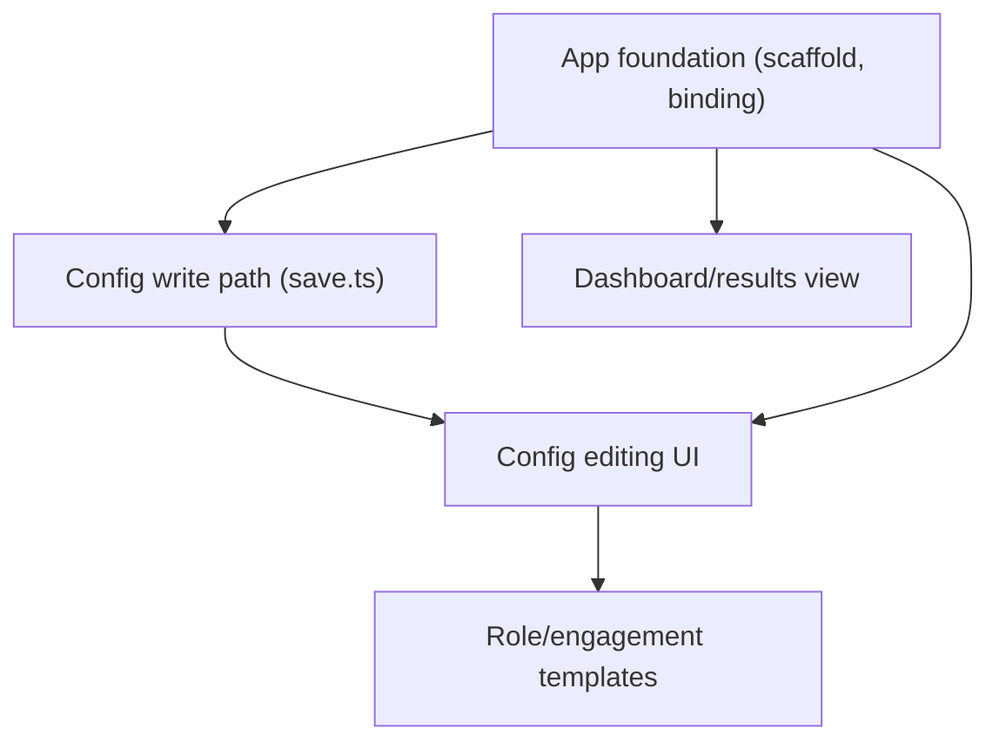

# Horizontal Plan: dashboard-config-ui

## 1. Layer Inventory

1. **App foundation** — Next.js app-router scaffold, Tailwind, localhost-only binding.
2. **Config write path** — `src/lib/config/save.ts`, the security-critical raw-JSON-only writer.
3. **Dashboard/results view** — read-only gigs list, filter/sort, status-change actions.
4. **Config editing UI** — form over Profile/Needs/Sources/RoleArea/schedule.
5. **Role/engagement templates** — seed data + picker.

## 2. Per-Layer Requirements

### 2.1 App foundation

- **Responsibility:** stand up the first UI code in this repo — nothing
  UI-layer-specific exists yet.
- **Key files/seams:** `src/app/layout.tsx`, `src/app/page.tsx`,
  `tailwind.config.*`, `next.config.js`, `package.json` script updates
  (`-H 127.0.0.1` on `dev`/`start`).
- **What it must do overall:** confirm `NODE_OPTIONS=--experimental-sqlite`
  threads through Next's own dev/build process (not just `tsx`/`vitest`)
  via a real `listGigs()` call in a Server Component/Route Handler, proven
  under both `next dev` and `next build && next start`; bind to localhost
  only by default.
- **Dependencies:** none upstream — this is the epic's foundation.

### 2.2 Config write path

- **Responsibility:** the epic's single highest-stakes correctness
  requirement — write edited config back to disk without ever leaking a
  resolved secret value.
- **Key files/seams:** new `src/lib/config/save.ts`, sibling to the
  existing `src/lib/config/load.ts` (unmodified) and `schema.ts` (reused
  for validation).
- **What it must do overall:** always re-read raw `config.json` directly
  (never derive from `loadConfig()`'s resolved output); ENOENT-tolerant
  (first-run = start from `config.example.json`'s shape); validate via
  `ConfigSchema.safeParse` before writing; set file permissions on write.
- **Dependencies:** none upstream beyond existing `config/schema.ts`. Does
  NOT depend on the App foundation layer functionally (it's pure
  Node file I/O) — only needs App foundation's scaffold to be *called
  from* a Server Action, which is a wiring dependency, not a design one.

### 2.3 Dashboard/results view

- **Responsibility:** the first user-visible payoff of this epic — see
  real gigs, change their status.
- **Key files/seams:** `src/app/page.tsx` or `src/app/dashboard/page.tsx`,
  reading `src/lib/store/index.ts`'s `listGigs()`/`setStatus()` (both
  unmodified, already ready).
- **What it must do overall:** tier tabs (All/Green/Yellow/Red) + status
  multi-select checkboxes, combined AND; default sort `firstSeen DESC`;
  company/title text search; status-change actions via Server Action;
  `Gig.raw` rendered as escaped text/JSON only, never
  `dangerouslySetInnerHTML`.
- **Dependencies:** App foundation (scaffold must exist). Does NOT depend
  on the config write path — it only reads the store, never touches config.

### 2.4 Config editing UI

- **Responsibility:** let the owner (and any future user) configure
  Profile/Needs/Sources/RoleArea/schedule without hand-editing JSON.
- **Key files/seams:** `src/app/config/page.tsx` (or similar), calling
  `src/lib/config/save.ts` (2.2) via a Server Action.
- **What it must do overall:** form covering the full `Config` shape;
  `SourceConfig.settings` as a key/value pairs editor (not a raw JSON
  blob); handles the ENOENT/first-run case from 2.2 gracefully (blank
  form from the example shape, not an error page).
- **Dependencies:** App foundation AND the config write path (2.2) — both
  must exist before this layer is meaningful.

### 2.5 Role/engagement templates

- **Responsibility:** default role/engagement presets (fractional
  CTO/COO/CFO/etc, per north_star) the user can start from.
- **Key files/seams:** new seed-data module (e.g.
  `src/lib/config/templates.ts`), consumed by a picker UI in 2.4's form.
- **What it must do overall:** generic `RoleAreaConfig` presets, no
  owner-specific criteria hardcoded; a "start from template" affordance in
  the config form.
- **Dependencies:** the config editing UI (2.4) must exist for the picker
  to have somewhere to live; the template DATA itself has no technical
  dependency on any other layer (pure content).

## 3. Cross-Layer Dependencies

- **App foundation → everything** (scaffold must exist for any UI to render).
- **Config write path (2.2) → Config editing UI (2.4)** — hard dependency,
  the UI has nothing to call otherwise. NOT required by Dashboard (2.3).
- **Dashboard (2.3) and Config write path (2.2) are mutually independent**
  — confirmed no shared dependency beyond the app foundation scaffold;
  either could be built first without blocking the other.
- **Role templates (2.5) → Config editing UI (2.4)** for the picker
  surface, but the template DATA can be authored independently/in parallel.

## 4. Layer Map Diagram

## 5. Scope Summary

The Config write path (2.2) carries the most risk-weight despite being
small in file count — it's the epic's one genuinely security-critical
piece, and per the design discussion's grill-resolved decision, its
mechanism is now fully specified. Dashboard (2.3) and Config editing UI
(2.4) are comparable in size; the UI form work in 2.4 is larger due to
covering the full `Config` shape plus the key/value settings editor.
Templates (2.5) is small in wiring but real in content-authoring effort
(per tpm's team-review finding). Total estimated new/modified files:
~20-25, concentrated in `src/app/`, `src/lib/config/save.ts` +
`templates.ts`, and their tests.
