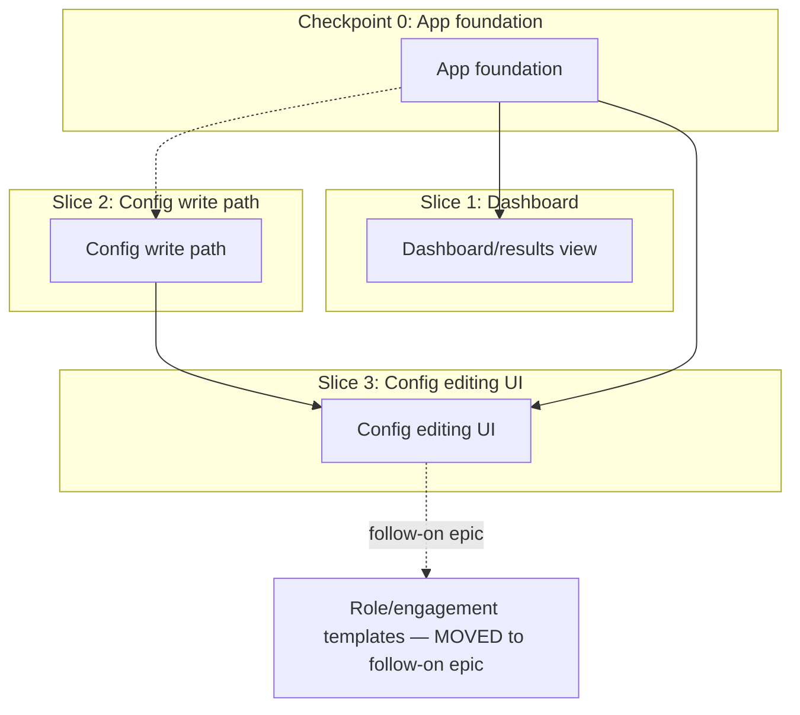

# Vertical Plan: dashboard-config-ui

## 1. Slicing Strategy

The horizontal map has one real fork: Dashboard and Config-write-path are
mutually independent (both depend only on App foundation), while Config
editing UI hard-depends on Config-write-path, and Templates depend on
Config editing UI existing. The cut below puts the App foundation work as
an explicit checkpoint (not a numbered "slice" — per the design
discussion's team-review correction, it has zero user-visible value on its
own and must not be tracked as if it were a shippable increment), then
sequences Dashboard first (the fastest path to real, visible payoff —
directly serves "see it all"), then the security-critical write path
(deserves its own focused story/review per the design discussion), then
the config UI that consumes it, then templates last (smallest, most
deferrable).

## 2. Vertical Slice Plan

### Checkpoint 0 — App foundation (not a vertical slice — explicit infra checkpoint)

- **Goal / what works after:** `next dev` and `next build && next start`
  both run cleanly, a trivial Server Component successfully calls
  `listGigs()` (proving `NODE_OPTIONS=--experimental-sqlite` threads
  through Next's own process model, not just `tsx`/`vitest`), the server
  binds to `127.0.0.1` only. NO user-visible dashboard content yet — a
  blank/placeholder page is acceptable.
- **Layers touched:** App foundation (full).
- **NOT yet included:** any real gig or config content on screen.
- **Verified-by:** the trivial store-call proof under both dev and
  build/start modes; a `git`/`curl`-based check that the bound host is
  `127.0.0.1`, not `0.0.0.0`.
- **What the commit represents:** the epic's foundational risk (Next.js +
  node:sqlite interop, an unverified assumption per the design discussion)
  is retired before any UI work is built on top of it.
- **Dependencies:** none.

### Slice 1 — Dashboard/results view (first real vertical slice)

- **Goal / what works after:** opening the dashboard in a real browser
  shows real gigs from the already-populated store (from
  `find-pipeline-foundation`/`browser-session-auth`), filterable by tier
  (tabs) and status (checkboxes, AND-combined), sorted `firstSeen DESC`,
  searchable by company/title, with working status-change actions
  (Applied/Interview/Archived/etc.) that persist via `setStatus()` — and
  ACTUALLY VISIBLY persist across a reload under `next build && next
  start`, not just `next dev` (team-review finding — architect, a real,
  confirmed gap: Next's App Router can statically cache a route via the
  Full Route Cache, and Server Actions do NOT auto-revalidate their
  calling route; without an explicit `revalidatePath()` call after
  `setStatus()`, this could pass under dev's looser caching and silently
  fail in a production build — exactly the dev/build divergence
  Checkpoint 0 already takes seriously for the SQLite question, extended
  here to a more common Next.js gotcha). This slice's Server Action
  ALSO establishes the shared convention (error shape: a typed
  `{ok: false, error: string}` return rather than a thrown exception
  crossing the client/server boundary; explicit `revalidatePath()` after
  every mutation) that Slice 3's config-save action reuses — named
  explicitly now (team-review finding — architect) since nothing
  otherwise forces the two Server Actions in this epic toward consistency.
- **Layers touched:** Dashboard/results view (full).
- **NOT yet included:** config editing, templates.
- **Verified-by:** manual browser verification under BOTH `next dev` and
  `next build && next start` (real gigs render correctly, a status change
  persists across a page reload in both modes) + automated tests for the
  Server Action wrapping `setStatus()` (including the unknown-key-throws-404
  case, mapped to the shared `{ok:false, error}` shape) against a temp DB.
- **What the commit represents:** the owner can, for the first time,
  actually SEE his pipeline through a UI instead of querying the SQLite
  file directly — the single most direct answer to "see it all."
- **Dependencies:** Checkpoint 0.

### Slice 2 — Config write path (security-critical, own focused story)

- **Goal / what works after:** `src/lib/config/save.ts` exists,
  independently tested, correctly round-trips an edit without ever
  touching a resolved secret value, handles the first-run (no
  `config.json`) case gracefully, and enforces file permissions on write.
  No UI consumes it yet in this slice.
- **Layers touched:** Config write path (full).
- **NOT yet included:** the config editing UI itself (next slice).
- **Verified-by:** `npm test` — the secret-preservation round-trip test is
  the single most important test in this epic (write, re-load the RAW
  file, assert no resolved secret value ever hit disk); ENOENT/first-run
  test; `ConfigSchema.safeParse` rejection tests for malformed edits;
  permission-mode-on-write test.
- **What the commit represents:** the epic's highest-risk correctness
  requirement is retired and independently proven, before any UI depends
  on it — mirrors `find-pipeline-foundation`'s persistence-before-adapter
  pattern.
- **Dependencies:** Checkpoint 0 (wiring only — functionally independent).

### Slice 3 — Config editing UI

- **Goal / what works after:** the owner can open `/config`, see his
  current Profile/Needs/Sources/RoleArea/schedule (or a blank first-run
  form if none exists yet), edit any field including a key/value editor
  for `SourceConfig.settings`, save, and have it persist correctly
  (verified against Slice 2's write path) — without ever hand-editing
  JSON.
- **Layers touched:** Config editing UI (full), consuming Slice 2.
- **NOT yet included:** role templates (next slice).
- **Verified-by:** manual browser verification (edit-and-reload round-trip
  preserves all fields including `env:` references shown as references,
  never resolved values) + automated tests for the Server Action wrapping
  `save.ts`.
- **What the commit represents:** the second half of "configure sources
  and criteria... without hand-editing JSON or running CLI scripts" is
  live.
- **Dependencies:** Checkpoint 0, Slice 2.

### Slice 4 — Role/engagement templates: MOVED OUT OF THIS EPIC

**Team-review correction (tpm): dropped from this epic's committed scope,
not just "easiest to defer."** With Checkpoint 0 + 3 real slices already
representing ~20-25 files including a full-`Config`-shape form, tpm
flagged the epic had crept toward Large-shaped work while still labeled
Medium. Templates is genuinely the most separable, lowest-risk unit (its
own risk assessment already says "content-authoring effort more than
technical risk") and depends only on Slice 3 existing — it becomes a
small, fast follow-on epic once this one ships, keeping THIS epic's scope
honest rather than quietly absorbing scope creep. See Deferred Items.

## 3. Overlay Diagram

## 4. Deferred Items

- **Role/engagement templates** (Slice 4, formerly in-scope) — moved to
  its own small follow-on epic per team review (tpm), to keep this epic's
  size proportionate to its Medium label. Depends only on Slice 3
  (config editing UI) existing.
- **Guided browser-session login/session-capture UI flow** — its own,
  separate, focused follow-on epic (per the design discussion's explicit
  scope-reduction decision, confirmed sound by team review).
- **Fully-typed per-source `SourceConfig.settings` editor** (source-aware
  field hints, not just a generic key/value editor) — real additional
  scope, not needed to clear the "no raw JSON" bar.
- **Pagination for `listGigs()`** — not needed at current data volumes;
  revisit if it becomes a real problem.
- **Automated E2E/browser testing framework** — this epic relies on
  manual browser verification for UI behavior; adding Playwright-for-testing
  or similar is a separate, explicit future decision.

## 5. Risk by Slice

- **Checkpoint 0 — Medium risk.** The `NODE_OPTIONS`/Next.js interop
  question is a real unknown until proven; if it fails, every later slice
  is blocked, which is exactly why it's verified first, not assumed.
- **Slice 1 — Low-medium risk.** Read-only, no security-critical logic;
  main risk is UX under-specification, which team review already tightened
  (concrete filter/sort spec).
- **Slice 2 — High risk.** The epic's single highest-stakes correctness
  requirement (secret-preservation). Isolated into its own slice
  specifically so it gets undivided review attention.
- **Slice 3 — Medium risk.** Depends on Slice 2 being correct; its own
  risk is UX completeness (full `Config` shape coverage) more than
  security, since the security logic already lives in Slice 2.
- **Slice 4 (templates) — moved out of this epic**, see §4.

## 6. Moldability Notes

- **Slice 1 and Slice 2 can run in either order, or in parallel** — the
  horizontal plan confirms they're mutually independent beyond
  Checkpoint 0. The order above (Dashboard first) is chosen because it's
  the faster path to visible payoff, not a hard technical requirement.
  Whichever lands first establishes the shared Server Action convention
  (typed `{ok,error}` return + `revalidatePath()`) the other reuses.
- **Checkpoint 0 is not moldable** — every other slice depends on it
  (Slice 2 only for wiring, but still needs the scaffold to exist to be
  called from anywhere a human interacts with).
