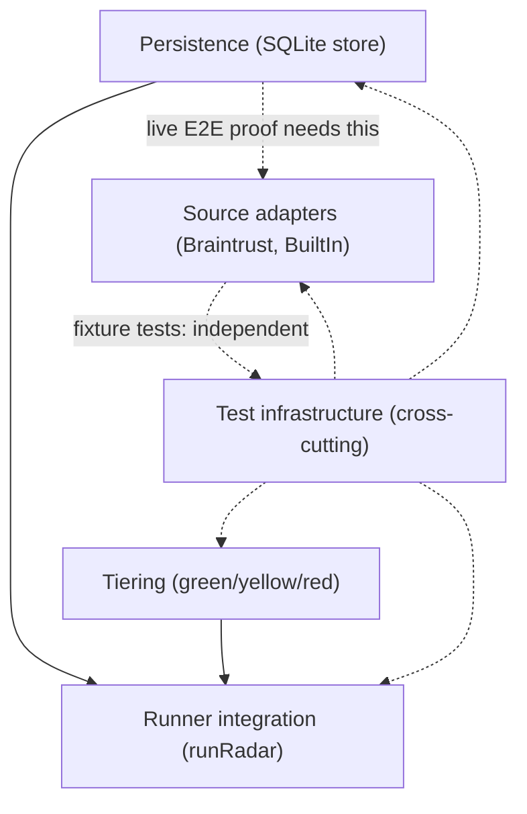

# Horizontal Plan: find-pipeline-foundation

Breadth-first layer map. This is what each layer needs OVERALL to fulfill the
epic — not an execution order (see `vertical-plan.md` for that).

## 1. Layer Inventory

1. **Persistence** — the new SQLite-backed store replacing in-memory-only dedup.
2. **Tiering** — the new green/yellow/red role-area classifier.
3. **Source adapters** — real fetch/normalize implementations (Braintrust, BuiltIn).
4. **Runner integration** — wiring persistence + tiering into `runRadar()`.
5. **Test infrastructure** — the epic's explicit "fully tested" mandate; currently zero test files exist anywhere in the repo, so this is a real layer, not an afterthought.

## 2. Per-Layer Requirements

### 2.1 Persistence

- **Responsibility:** durable, atomic, single-source-of-truth storage for
  scanned `Gig` records, their status history, and delisting state — replacing
  `runRadar()`'s current in-memory-only `seen` Set (`src/lib/apply/runner.ts`).
- **Key files/seams:** new module at `src/lib/store/` (exact filenames TBD in
  story-writing); consumed by `src/lib/apply/runner.ts`'s `runRadar()`.
- **What it must do overall:**
  - Upsert scanned gigs, preserving user-set fields (`status`, first-seen
    timestamp) across re-scans — ported logic, not ported code, from legacy
    `store.mjs upsertScan()` (research brief §3).
  - Implement the delisting-detection algorithm correctly: only flag a stored
    gig `unavailableSince` when its *source* returned results this run (an
    `activeSources`-style check) but that specific gig didn't reappear —
    never when the source scrape simply failed or returned 0.
  - Use SQLite with WAL mode + `busy_timeout` + a single shared connection
    module (design-discussion §3 step 1, architect team-review finding) —
    not a `new Database()` per call site, to survive a Next.js dev server and
    a separate cron/CLI process both touching the same file.
  - Default the DB file path to a user-data directory outside the repo tree
    (XDG-style), not `./data/` (security-reviewer team-review finding); add a
    `.gitignore` pattern as belt-and-suspenders.
  - Expose all access through this module's exported functions only — no raw
    SQL from call sites (architect team-review finding, sets up the future
    UI epic's read contract cheaply).
- **Dependencies:** none upstream (foundational layer). Downstream: source
  adapters (write path) and runner integration (read/write orchestration)
  depend on this layer existing.

### 2.2 Tiering

- **Responsibility:** classify a `Gig` as green/yellow/red role-area fit, with
  a reason, alongside (not inside) the existing pass/fail `gate()`.
- **Key files/seams:** new `src/lib/matching/tiering.ts`, sibling to
  `src/lib/matching/gate.ts`; consumes `Gig` + a user-configured role-area
  config (new type, TBD in story-writing, NOT hardcoded keywords per
  `docs/ARCHITECTURE.md`'s core/user-layer boundary).
- **What it must do overall:**
  - Pure function, no I/O — same shape as `gate()`'s `ok()`/`fail()`
    reason-accumulator pattern (researcher team-review, confirmed against
    actual `gate.ts` code).
  - Implement title-first precedence, word-boundary keyword matching — the
    legacy `config.mjs` precedence order (green.coreTitles in title → GREEN;
    red.keywords in title → RED; broader keyword match in title+description
    next; unmatched → YELLOW, never a hard reject) is the *shape* to
    translate, never its hardcoded personal keyword lists.
  - Extend `MatchResult` (or wrap it) to carry a `tier` field — `types.ts`
    has no such field today (architect + researcher, independently
    confirmed team-review finding).
- **Dependencies:** depends only on `gate.ts`'s existing `MatchResult` shape
  and the `Gig` type — **does NOT depend on the persistence layer** (tpm
  team-review correction; an earlier draft mis-sequenced this).

### 2.3 Source adapters

- **Responsibility:** real, live `Source` implementations replacing the
  single hardcoded fixture (`example-source.ts`).
- **Key files/seams:** new files under `src/lib/sources/` (e.g.
  `braintrust.ts`, `builtin.ts`), each implementing the existing `Source`
  contract (`src/lib/sources/source.ts`) and registered via
  `registerSource()`.
- **What it must do overall:**
  - Braintrust and BuiltIn only, this epic (design-discussion §3 step 4,
    team-review-resolved committed scope). Both are `auth: "none"` public
    boards per legacy `platforms.mjs` — no session/credential handling
    needed for either.
  - Fetch + normalize to real `Gig` objects with real per-listing URLs (never
    a search page) — the existing data-integrity rule, unchanged.
  - Throw on fetch failure — never return an empty array as if "no matches"
    (existing convention, already implemented correctly in `runRadar()`'s
    per-source try/catch; adapters must honor it, not work around it).
  - Unit tests against recorded, PII-scrubbed HTTP fixtures — not live
    network calls in the automated suite (security-reviewer team-review
    finding: fixtures must be sanitized before commit).
  - One documented manual live run per adapter, performed and recorded
    during the story's `implement` step (not a separate human-only gate) —
    this is what actually backs the "live results" done-criterion.
- **Dependencies:** the `Source` contract and `Gig` type already exist and
  are unchanged; adapters don't depend on persistence or tiering to be
  *implemented*, but need the persistence layer to be meaningfully
  *integration-tested* end-to-end (see §3 below).

### 2.4 Runner integration

- **Responsibility:** wire persistence + tiering into the existing
  `runRadar()` discover→gate pipeline without breaking its current
  correct behavior (per-source isolation, throw-surfacing, in-order gate
  application).
- **Key files/seams:** `src/lib/apply/runner.ts` (existing, modify in place).
- **What it must do overall:**
  - After `gate()` produces a `MatchResult`, call the new tiering function
    and attach its result.
  - Replace the in-memory `seen` Set dedup with a call into the persistence
    layer's upsert path.
  - Preserve every existing correctness property: per-source try/catch
    isolation, throw-on-auth-failure surfaced as `errors[]`, nothing
    silently dropped.
- **Dependencies:** depends on both the persistence layer and the tiering
  layer being implemented (this is the integration point where both land).

### 2.5 Test infrastructure

- **Responsibility:** make "fully tested" real, not aspirational — the
  project's explicitly stated pain point (kickoff `north_star.pain_points`).
- **Key files/seams:** `vitest` is already configured in `package.json`
  (zero test files exist today); new test files co-located per module
  (persistence, tiering, each adapter).
- **What it must do overall:**
  - Persistence: pure-function-style unit tests for upsert/dedup/delisting
    logic (can run against an in-memory or temp-file SQLite instance, no
    live network).
  - Tiering: golden-fixture unit tests per classification rule, mirroring
    `gate.ts`'s existing testable-pure-function shape.
  - Adapters: unit tests against recorded, sanitized fixture responses.
  - No live-network calls anywhere in the automated (`npm test`) suite — the
    one-time manual live run per adapter is explicitly outside this
    automated layer (design-discussion §7).
- **Dependencies:** cross-cutting — depends on all four other layers
  existing to have something to test, but is not itself a layer any other
  layer depends on.

## 3. Cross-Layer Dependencies

- **Persistence → Source adapters (integration-testing only):** adapters can
  be implemented and unit-tested against fixtures independently of
  persistence, but a real end-to-end "fetch → gate → tier → persist → query
  back" proof needs persistence to exist first.
- **Persistence → Runner integration:** hard dependency — the runner can't
  call a store that doesn't exist yet.
- **Tiering → Runner integration:** hard dependency — same reasoning.
- **Tiering ⊥ Persistence:** explicitly NOT dependent on each other (tpm
  team-review correction) — both are pure/isolated enough to build in either
  order, or in parallel.
- **Test infrastructure:** shadows every other layer 1:1; not a separate
  sequencing concern, but every story in every other layer carries its own
  tests as part of that story, not as a follow-up.

## 4. Layer Map Diagram

Solid arrows are hard dependencies; dashed arrows are soft/testing
relationships. Persistence and Tiering have no edge between them — confirmed
independent per the tpm team-review correction.

## 5. Scope Summary

Persistence carries the most weight — it's new infrastructure (SQLite +
connection management + upsert/delisting logic), the highest-risk unknown
identified in the design discussion, and the layer every other layer
ultimately reads through or writes to. Tiering is a medium, self-contained
unit of new design work with no existing TS reference to build against (only
a legacy JS shape to translate). The two adapters are comparatively
mechanical once the `Source` contract and fixture-testing pattern are
established by the first one — the second should be materially faster than
the first. Test infrastructure is not a separate time cost; it's folded into
each layer's own stories per the epic's explicit "tests throughout" mandate.
Total estimated new/modified files: ~12-18 (matches design-discussion §8),
concentrated in `src/lib/store/`, `src/lib/matching/tiering.ts`,
`src/lib/sources/{braintrust,builtin}.ts`, and their respective test files,
plus `runner.ts` modifications.
