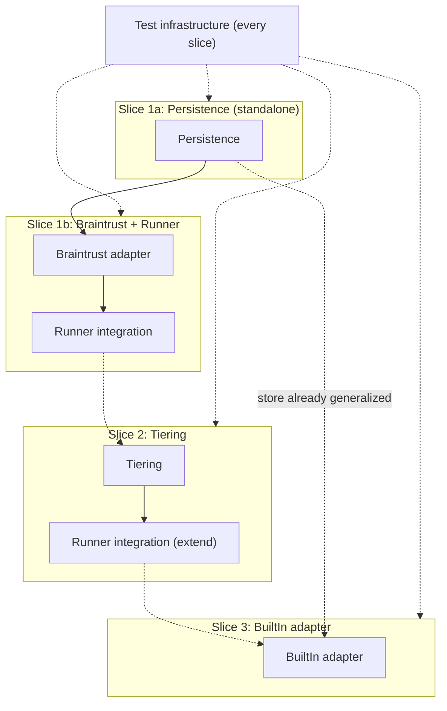

# Vertical Plan: find-pipeline-foundation

Cuts the horizontal layer map (`horizontal-plan.md`) into minimum cross-stack
increments, each producing a working, demo-able, commit-worthy state.

## 1. Slicing Strategy

The horizontal map has one hard sequencing constraint (Persistence →
Runner integration, and Tiering → Runner integration) and one confirmed
non-dependency (Tiering ⊥ Persistence — they don't block each other). The
slice cut follows the hard constraint: get one real adapter flowing through
persistence and the runner end-to-end first (the thinnest possible proof
that the whole pipeline actually works, live), then add tiering, then add
the second adapter to prove the persistence/runner integration generalizes
beyond the first adapter. Tests are not a separate slice — every slice ships
its own tests as an internal requirement, per the epic's "tests throughout"
mandate.

## 2. Vertical Slice Plan

### Slice 1a — Persistence (standalone, unit-tested checkpoint)

*(Split from a single larger Slice 1 during H/V team review — tpm flagged
that bundling persistence + first adapter + runner integration into one
unverified block put most of the epic's real engineering risk behind a
single, late checkpoint. Splitting gives a real, independently-verifiable
stopping point.)*

- **Goal / what works after:** the SQLite-backed store (`src/lib/store/`)
  exists, is fully unit-tested standalone, and correctly implements
  upsert/dedup, status/first-seen preservation across re-scans, and the
  delisting-detection algorithm (`activeSources`-gated `unavailableSince`
  flagging) — all verifiable without any real adapter or live network call.
- **Layers touched:** Persistence (full).
- **NOT yet included:** any Source adapter wired to it, Runner integration,
  Tiering.
- **Verified-by:** `npm test` only — upsert/dedup/delisting-logic unit tests
  against a temp/in-memory SQLite instance, including a test that
  reproduces the delisting algorithm's core guarantee (a source returning 0
  results must NOT flag that source's gigs unavailable; a source returning
  results but missing one specific gig MUST flag that gig). WAL mode +
  busy_timeout + shared-connection-module behavior verified by a
  concurrent-writer test (two connections writing at once, neither errors).
- **What the commit represents:** the epic's single highest-risk unknown
  (persistence design) is retired and independently proven correct, before
  any adapter work depends on it.
- **Dependencies:** none (this is the epic's first slice).

### Slice 1b — Braintrust adapter + runner integration (end-to-end proof)

- **Goal / what works after:** running `npm run radar` (or equivalent) with
  Braintrust enabled fetches real listings, gates them, persists them via
  Slice 1a's store, and running it a second time correctly preserves
  status/first-seen and demonstrates delisting behavior live (not just in
  Slice 1a's unit tests).
- **Layers touched:** Source adapters (Braintrust only), Runner integration
  (full).
- **NOT yet included:** Tiering (gate pass/fail only, no green/yellow/red
  yet), BuiltIn adapter.
- **Verified-by:** `npm test` (Braintrust adapter unit tests against
  sanitized recorded fixtures) + the one-time manual live run (confirms
  real `Gig` objects with real per-listing URLs, recorded in the story) + a
  manual two-run demonstration of status preservation and delisting
  behavior against the real Braintrust board.
- **What the commit represents:** the pipeline is real end-to-end for the
  first time — no more in-memory-only, no more fixture-only source.
- **Dependencies:** Slice 1a (persistence must exist to integrate against).

### Slice 2 — Tiering

- **Goal / what works after:** every gated gig (from Slice 1's Braintrust
  flow) now also carries a green/yellow/red tier + reason. Tier is visible
  in whatever the runner currently surfaces (console output / persisted
  record), even though there's no dashboard to view it in yet.
- **Layers touched:** Tiering (full), Runner integration (extend to call
  tiering after gate + persist the tier).
- **NOT yet included:** any UI/dashboard surface for tier (out of epic
  scope entirely, not just deferred to a later slice).
- **Verified-by:** `npm test` (tiering unit tests: golden fixtures per
  classification rule — title-first precedence, word-boundary matching,
  green/red/yellow precedence order) + a manual check that Slice 1's
  Braintrust results now carry a sensible tier.
- **What the commit represents:** the gate's binary pass/fail becomes a
  ranked, explainable "worth a look" signal — the actual value proposition
  gigradar adds over a raw job-board search.
- **Dependencies:** the tiering *computation* depends only on `gate.ts`'s
  existing `MatchResult` shape (confirmed independent of Persistence per the
  horizontal plan). The *persist-the-tier* half of this slice's scope does
  depend on Slice 1a/1b already existing — see the H/V review correction in
  Moldability Notes below before assuming this slice is freely reorderable.

### Slice 3 — BuiltIn adapter (generalization proof)

- **Goal / what works after:** BuiltIn is a second live, gated, tiered,
  persisted source alongside Braintrust — proving the Slice 1 persistence
  and runner integration work generalizes to more than one adapter, not
  just the first one it was built against.
- **Layers touched:** Source adapters (BuiltIn).
- **NOT yet included:** A.Team, GoFractional, or any other legacy platform —
  explicitly out of this epic's committed scope (design-discussion §3
  step 4).
- **Verified-by:** `npm test` (BuiltIn adapter unit tests against sanitized
  fixtures) + the same one-time manual live run pattern as Slice 1 + a
  manual two-source run confirming both adapters' results coexist correctly
  in the store (no id collisions, dedup still correct across sources).
- **What the commit represents:** the epic's committed scope is complete —
  2 real adapters, persisted, tiered, tested.
- **Dependencies:** Slice 1a (Persistence) and Slice 1b (Runner integration)
  must exist. Does not depend on Slice 2 (Tiering) functionally, though by
  this point tiering will already be wired in from Slice 2 — architect
  team-review confirmed this "for free" claim holds: tiering runs per-`Gig`
  in Runner integration, source-agnostic, so no BuiltIn-specific tiering
  work is needed.

## 3. Overlay Diagram

## 4. Deferred Items

- **A.Team and GoFractional adapters** — explicitly deferred past this epic,
  gated on a separate secrets/session-storage design decision (both need
  non-`"none"` auth). Not a slice in this plan at all.
- **Gated auto-apply / assisted-apply drafting** — `stageApplication()`
  stays a stub; entirely out of this epic per the user's confirmed scope.
- **Dashboard/config UI** — `has_ui: true` on the project profile, but no
  slice here touches `src/app/`. A future epic will need to design the read
  contract against the persistence module built in Slice 1 (the module
  boundary requirement in the horizontal plan sets this up cheaply).
- **CI infrastructure** — this epic makes `npm test` meaningful (currently
  zero test files) but does not stand up GitHub Actions or any CI runner.

## 5. Risk by Slice

- **Slice 1a — Medium-high risk.** The epic's single highest-risk unknown
  (persistence design: SQLite schema, WAL/busy_timeout/shared-connection
  behavior, the delisting algorithm's correctness) lives entirely here, but
  it's now independently verifiable by unit + concurrent-writer tests before
  anything else depends on it — the risk is contained, not eliminated.
- **Slice 1b — High risk, and the likeliest place an execution agent stalls**
  (tpm team-review finding). Specifically: the one-time manual live-network
  run and the manual two-run status/delisting demonstration are both
  non-deterministic, network-dependent steps with no automated fallback —
  an agent session without live network access, or hitting a live-site
  layout change, will stall here, not at persistence itself. Cross-process
  SQLite contention (dev server + this integration test both touching the
  store) is the secondary risk if Slice 1a's WAL/busy_timeout work wasn't
  actually exercised under concurrency.
- **Slice 2 — Medium risk.** New design work with no existing TS reference
  (only a legacy JS shape to translate correctly) — getting the precedence
  rules subtly wrong is the dominant risk, not a technical-feasibility one.
- **Slice 3 — Low risk.** By this point the store, runner integration, and
  fixture-testing pattern are all established; this slice is materially
  mechanical relative to Slice 1a/1b.

## 6. Moldability Notes

- **Correction from H/V team review (architect):** tiering *computation* is
  independent of persistence, but Slice 2's own scope also includes
  "persist the tier" (extending Runner integration), which requires Slice
  1a's store and Slice 1b's runner integration to already exist. Slice 2 as
  scoped is NOT freely reorderable ahead of Slice 1a/1b. If there's a real
  need to start tiering work early, split it further: a tiering-computation-
  only sub-slice (pure function, fully testable in isolation, genuinely
  parallelizable with Slice 1a/1b) versus a tiering-persistence sub-slice
  (blocked on Slice 1a/1b, same as currently scoped).
- **Slice 3 is the easiest to defer or drop** without invalidating anything
  upstream — if time runs short, Slices 1a+1b+2 alone already satisfy most
  of the "done" criteria (live, gated, tiered, persisted, tested) for at
  least one real source, just not the "two adapters" committed-scope target.
