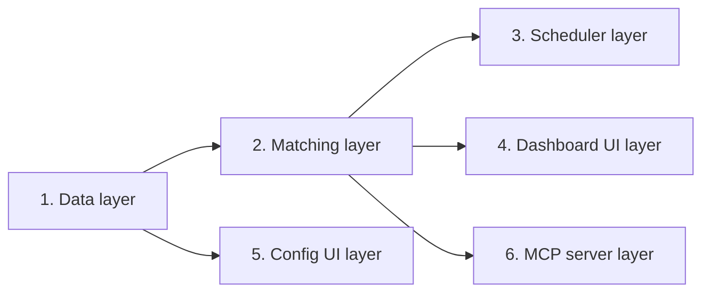

# Horizontal Plan: Multi-Group Architecture

Maps every architectural layer this epic touches and the real dependency order between them, per the design discussion's corrected model: a gig can match zero, one, or many groups (`matched_group_ids`, mirroring the existing `matchedProfileIds` pattern); sources are shared and evaluated against every in-scope group; application state (status/drafts/outcome) stays exactly as it is today, one per gig.

## Layers, in dependency order

### 1. Data layer (foundation — nothing else can start without this)
- `src/lib/store/schema.ts` — add `matched_group_ids TEXT` to `gigs` (nullable JSON array, additive).
- `src/lib/store/db.ts` — `ensureColumn()` migration entry.
- `src/lib/store/types.ts`/`gigs.ts` — `StoredGig.matchedGroupIds?: string[]`, row mapping, a new `GigFilter.groupId` option.
- `src/lib/types.ts` — new `GroupConfig` interface `{id, label, needs, roleArea?}`; `Config.groups: GroupConfig[]` replacing today's flat `needs`/`roleArea`.
- `src/lib/config/load.ts` — migrate-on-read: a legacy flat config (no `groups[]`) wraps its existing `needs`/`roleArea` into one implicit group on first read after upgrade (mirrors the existing `migrateNeedsEngagementProfiles()` precedent exactly).
- `src/lib/config/save.ts`/`config/schema.ts` (zod validation) — `GroupConfig`/`groups[]` schema, `saveConfig()` unchanged (shallow-merge already generic).

### 2. Matching layer (depends on: data layer)
- `src/lib/apply/runner.ts` — `runRadar()`'s core loop: replace the single `gate(g, config.needs, config.profile)` / `tier(g, config.roleArea)` calls with a per-gig loop over every in-scope group, unioning cleared group ids into `matched_group_ids`. `gate()`/`tiering.ts` themselves need NO signature change.
- New small helper (e.g. `matchGroups(gig, groups, profile): string[]`) — pure, directly unit-testable, the one real piece of new business logic in this whole epic.
- Source-to-group scoping: `SourceConfig` gains optional `groupIds?: string[]`; absent = evaluate against all groups (the default, per the owner's own correction).

### 3. Scheduler layer (depends on: matching layer only — structurally unaffected)
- `src/scheduler/index.ts` — no structural change (still one process, one croner job, one `Config`); `runCycle()` just calls the now-group-aware `runRadarFn()`. Confirm via existing scheduler tests that nothing here assumed single-group matching results.

### 4. Dashboard UI layer (depends on: data + matching layers)
- `src/app/[group]/page.tsx` (new dynamic route, owner's own decision) — `listGigs({groupId})` filtering by `matched_group_ids CONTAINS group`.
- `src/app/nav-header.tsx` — group switcher.
- `src/app/dashboard-client.tsx` — minimal change if filtering happens server-side in the new route; otherwise a new filter dimension mirroring the existing profile-multi pattern.
- Migration UX: first load after upgrade shows exactly one group (whatever the legacy config becomes) — must look and behave identically to today for a not-yet-multi-group install.

### 5. Config UI layer (depends on: data layer only — independent of dashboard UI layer)
- `src/app/config/config-client.tsx` — group management (add/rename/remove), a group picker driving which group's Needs/RoleArea form is showing, per-source `groupIds` scope control.
- `src/app/setup/setup-wizard-client.tsx` — the guided wizard likely needs a "which group is this for" framing too, at least for a first group.

### 6. MCP server layer (depends on: data + matching layers — independent of both UI layers)
- `src/mcp/server.ts` — optional `groupId` param on `list_gigs`/`get_status_summary`; `run_scan` unaffected (still one shared scan, now group-aware internally).

## Cross-layer dependency graph

Layers 3, 4, 5, 6 have no dependency on each other — only on 1/2 — so they can be sequenced independently once the data+matching foundation lands.
